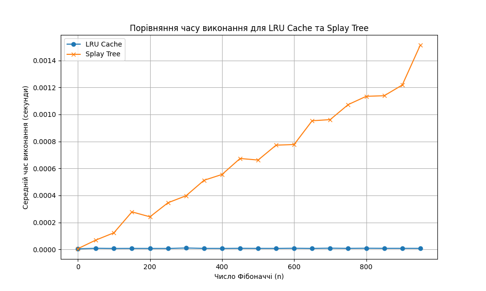

# GoIT Algo 2 HW 7

## Task 1 - Оптимізація доступу до даних за допомогою LRU-кешу

## Task 2 - Реалізація обчислення чисел Фібоначчі з LRU-кешем

|n         |LRU Cache Time (s)  |Splay Tree Time (s)|
|:--:|:----:|:----:|
|0         |0.00000459          |0.00000549
|50        |0.00000875          |0.00006956
|100       |0.00000745          |0.00012326
|150       |0.00000783          |0.00027816
|200       |0.00000748          |0.00024162
|250       |0.00000733          |0.00034585
|300       |0.00001056          |0.00039729
|350       |0.00000794          |0.00051218
|400       |0.00000766          |0.00055543
|450       |0.00000847          |0.00067367
|500       |0.00000796          |0.00066213
|550       |0.00000778          |0.00077240
|600       |0.00000882          |0.00077721
|650       |0.00000777          |0.00095333
|700       |0.00000936          |0.00096148
|750       |0.00000806          |0.00107293
|800       |0.00000891          |0.00113409
|850       |0.00000830          |0.00113876
|900       |0.00000829          |0.00121779
|950       |0.00000813          |0.00151356

### Порівняння часу виконання
